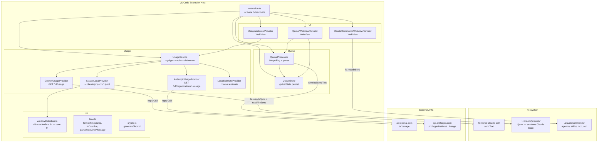

# Architecture — Prompt Queue + Usage Monitor
> Mis à jour le 2026-04-04 — v0.3.5

## Vue d'ensemble



## Flux de livraison d'un prompt

```
Utilisateur → commande queuePrompt / queueFromEditor / queueFromClipboard
  → input prompt text + délai (minutes ou HH:MM)
  → QueueStore.add({ notBefore, promptText, ... })

QueueProcessor tick (60s interval + window focus event) :
  Si _paused → return 0
  Pour chaque item due (notBefore ≤ now) :
    deliver(item) :
      Trouve terminal Claude (priorité : config > hint > nom "Claude" > actif)
      Vérifie terminal.exitStatus (zombie terminal → warning)
      terminal.sendText(sanitizedPrompt, false) + sendText("\r", false)
      store.addDeliveryLogEntry({ status: "delivered" })  ← AVANT remove
      store.remove(item.id)
    Sur erreur transiente → backoff exponentiel (60s/120s/240s, max maxDeliveryRetries)
    Sur NonRetryableDeliveryError → notifier l'utilisateur, garder en queue
  Émet onDidChange → QueueWebviewProvider refresh
```

## Flux Rate Limit

```
Utilisateur rate-limité → copie le message → commande imRateLimited
  → vscode.env.clipboard.readText()
  → parseRateLimitMessage(text) → RateLimitInfo { delayHours, resetAt, confidence }
  → QuickPick avec délai pré-calculé
  → QueueStore.add({ notBefore = now + délai })
  → Si resetAt présent → usageService.setWindowHint(resetAt)
      → UsageService._refreshing guard (debounce)
      → refresh immédiat du panel Usage
      → ClaudeLocalProvider.fetchUsage() utilise le hint en priorité
```

## Flux Pause / Reprise

```
Utilisateur → bouton ⏸ dans QueueWebviewProvider ou commande togglePause
  → QueueProcessor.togglePause()
      → _paused = !_paused
      → onDidChange.fire()
  → context.globalState.update("promptQueue.paused", processor.isPaused())
  → QueueWebviewProvider affiche la bannière d'avertissement si pausé

Au démarrage (extension.ts activate) :
  → Si globalState.get("promptQueue.paused") == true → processor.togglePause()
```

## Flux Export / Import Queue

```
Export :
  → QueueWebviewProvider.exportQueue()
  → Filtre items pending (processed == false)
  → Retire les champs machine-spécifiques : workspaceFolder, targetTerminalName, deliveryAttempts
  → vscode.workspace.fs.writeFile(uri, JSON)

Import :
  → QueueWebviewProvider.importQueue()
  → vscode.workspace.fs.readFile(uri)
  → Pour chaque item : isValidQueueItemShape() → rejet si invalide
  → Déduplique sur item.id (ignore les doublons)
  → Réinitialise workspaceFolder = workspace courant, targetTerminalName = "", deliveryAttempts = 0
  → QueueStore.add()
```

## Flux Usage (lecture locale)

```
ClaudeLocalProvider.fetchUsage() :
  → fs.readdirSync(~/.claude/projects/)
  → Pour chaque projet → fs.readdirSync(*.jsonl)
  → JSON.parse par ligne → filtrer par timestamp (5h / 7d)
  → sommer input_tokens + output_tokens + cache_*
  → Appel detectWindowStart(sortedEntries, nowMs, hintResetMs?)
      → windowDetection.ts : pure function
      → Si hint futur → fenêtre = hint - 5h
      → Sinon : scanne les entrées, gap ≥ 5h = reset de fenêtre
      → Retourne le timestamp de début de fenêtre ou null
  → Efface _windowHint si expiré (impure — séparé de la fn pure)
  → Retourne TokenUsage { tokensLast5h, tokensLast7d, breakdown[], hourlyLast24h[], currentWindowStart?, currentWindowEnd? }
```

## Composants clés

### QueueStore
- Persistance : `vscode.Memento` (globalState, clé : `promptQueue.items`)
- Survit aux redémarrages VS Code
- Méthodes : `getAll()`, `getPending()`, `add()`, `update()`, `remove()`, `addDeliveryLogEntry()`, `getDeliveryLog()`
- Log de livraison : 20 dernières entrées (newest-first), clé `promptQueue.deliveryLog`
- Export : `isValidQueueItemShape()` — type guard pour la validation à l'import

### QueueProcessor
- Polling : `setInterval(60s)` + déclenchement sur focus fenêtre VS Code
- Livraison : `terminal.sendText()` vers le terminal Claude actif (pas `workspace.fs.writeFile`)
- Backoff exponentiel : 60s / 120s / 240s jusqu'à `maxDeliveryRetries` (défaut 3)
- Pause : `_paused` (en mémoire), persisté dans `globalState` par `extension.ts`
- `isPaused()`, `togglePause()`, `forceDeliver(id)` — force-send bypass la pause
- Émet `onDidChange` à chaque livraison, retry, et toggle pause

### UsageService
- Stratégie : fetch tous les providers en parallèle
- Cache : `cachedResult` (synchrone pour l'UI)
- Auto-refresh : `setInterval(refreshIntervalMinutes * 60000)`
- `setWindowHint(resetAt)` : debounce via `_refreshing` flag (évite les refreshs empilés)
- Émet `onDidChange` → webview se met à jour

### Providers

| Provider | Source | Credentials |
|----------|--------|-------------|
| `ClaudeLocalProvider` | `~/.claude/projects/*.jsonl` | Aucun |
| `OpenAIUsageProvider` | `api.openai.com/v1/usage` | Clé org admin (`sk-org-…`) |
| `AnthropicUsageProvider` | `api.anthropic.com/v1/organizations/{orgId}/usage` | Clé admin |
| `LocalEstimateProvider` | Queue locale (chars/4) | Aucun |

### WebView Providers
- `UsageWebviewProvider` : panneau "Usage Monitor" — tokens 5h/7d, quotas, sparkline 24h, breakdown par modèle, fenêtre courante
- `QueueWebviewProvider` : panneau "Prompt Queue" — liste, ajout, snooze, suppression, force-send, export/import, pause, delivery log
- `ClaudeCommandsWebviewProvider` : panneau "Claude Commands" — scanne `.claude/commands/`, agents, skills, MCP servers ; preview inline, création de commande, recherche live

### windowDetection.ts
- Fonction pure exportée : `detectWindowStart(sortedEntries, nowMs, hintResetMs?)`
- Algorithme : si `hintResetMs` est dans le futur → retourne `hintResetMs - FIVE_HOURS_MS`
- Sinon : remonte les entrées triées, cherche un gap ≥ 5h ; l'ancre + 5h ≤ now → retourne null
- Constante exportée : `FIVE_HOURS_MS = 5 * 3_600_000`

## Décisions techniques

| Décision | Raison |
|----------|--------|
| Zéro dépendances runtime | Extension légère, pas de node_modules à bundler |
| `terminal.sendText()` pour la livraison | Seul moyen d'envoyer du texte à Claude Code CLI dans VS Code |
| `globalState` pour la queue et la pause | Persist natif VS Code, pas de fichier externe à gérer |
| `SecretStorage` pour les clés | API sécurisée VS Code (OS keychain), jamais en settings |
| `fs.readdirSync` au lieu de `glob` | Évite la dépendance `@types/glob` problématique |
| `detectWindowStart` fonction pure | Testable unitairement sans mock, séparation claire des effets de bord |
| ClaudeLocalProvider prioritaire | Données réelles sans credentials, couvre tout Claude Code CLI |
| Debounce `setWindowHint` via `_refreshing` | Évite les refreshs empilés lors de messages rate-limit rapprochés |

## Limites connues

- VS Code ne permet pas de lire stdout/stderr d'un terminal → clipboard est le seul vecteur pour le rate limit
- `terminal.sendText()` peut envoyer vers un terminal zombie (exitStatus défini) → warning best-effort uniquement
- OpenAI/Anthropic providers inutiles pour les utilisateurs Claude Code CLI (pas de clé admin)
- Les tests d'intégration nécessitent une instance VS Code réelle (`@vscode/test-electron`)
