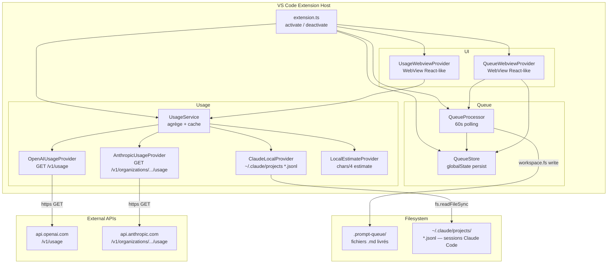

# Architecture — Prompt Queue + Usage Monitor
> Mis à jour le 2026-03-27 via /workflows/bmad-brownfield

## Vue d'ensemble



## Flux de livraison d'un prompt

```
Utilisateur → commande queuePrompt
  → input prompt text
  → input délai (minutes)
  → QueueStore.add({ notBefore, promptText, ... })
  → QueueProcessor tick (60s)
    → getPending().filter(isOverdue)
    → workspace.fs.writeFile(.prompt-queue/{timestamp}_{id}.md)
    → item.processed = true → QueueStore.update()
    → QueueWebviewProvider refresh
```

## Flux Rate Limit

```
Utilisateur rate-limité → copie le message → commande imRateLimited
  → vscode.env.clipboard.readText()
  → parseRateLimitMessage(text) → RateLimitInfo { delayHours, resetAt, confidence }
  → QuickPick avec délai pré-calculé
  → QueueStore.add({ notBefore = now + délai })
```

## Flux Usage (lecture locale)

```
ClaudeLocalProvider.fetchUsage()
  → fs.readdirSync(~/.claude/projects/)
  → pour chaque projet → fs.readdirSync(*.jsonl)
  → JSON.parse par ligne → filtrer par timestamp (5h / 7d)
  → sommer input_tokens + output_tokens + cache_*
  → retourner TokenUsage { tokensLast5h, tokensLast7d, breakdown[] }
```

## Composants clés

### QueueStore
- Persistance : `vscode.Memento` (globalState, key: `promptQueue.items`)
- Survit aux redémarrages VS Code
- Méthodes : `getAll()`, `getPending()`, `add()`, `update()`, `remove()`, `clear()`

### QueueProcessor
- Polling : `setInterval(60s)`
- Livraison : `vscode.workspace.fs.writeFile()` (cross-platform, respecte le workspace)
- Résolution collisions : `resolveCollision()` dans `util/fs.ts`
- Émet `onDidChange` après chaque livraison (pour refresh UI)

### UsageService
- Stratégie : fetch tous les providers en parallèle, préfère le premier sans erreur
- Cache : `cachedResult` (synchrone pour l'UI)
- Auto-refresh : `setInterval(refreshIntervalMinutes * 60000)`
- Émet `onDidChange` → `UsageWebviewProvider` se met à jour

### Providers (priorité décroissante)

| Provider | Source | Credentials |
|----------|--------|-------------|
| `ClaudeLocalProvider` | `~/.claude/projects/*.jsonl` | Aucun |
| `OpenAIUsageProvider` | `api.openai.com/v1/usage` | Clé org admin (`sk-org-…`) |
| `AnthropicUsageProvider` | `api.anthropic.com/v1/organizations/{orgId}/usage` | Clé admin |
| `LocalEstimateProvider` | Queue locale (chars/4) | Aucun |

### WebView Providers
- `UsageWebviewProvider` : panneau "Usage Monitor" — affiche tokens 5h/7d, quotas, breakdown par modèle
- `QueueWebviewProvider` : panneau "Prompt Queue" — liste, ajout, suppression, livraison manuelle

## Décisions techniques

| Décision | Raison |
|----------|--------|
| Zéro dépendances runtime | Extension légère, pas de node_modules à bundler |
| `workspace.fs` pour les fichiers | Cross-platform (y compris Remote SSH, WSL) |
| `globalState` pour la queue | Persist natif VS Code, pas de fichier externe à gérer |
| `SecretStorage` pour les clés | API sécurisée VS Code (OS keychain), jamais en settings |
| `fs.readdirSync` au lieu de `glob` | Évite la dépendance `@types/glob` problématique |
| ClaudeLocalProvider prioritaire | Données réelles sans credentials, couvre tout Claude Code CLI |

## Limites connues

- VS Code ne permet pas de lire stdout/stderr d'un terminal → clipboard est le seul vecteur pour le rate limit
- OpenAI/Anthropic providers inutiles pour les utilisateurs Claude Code CLI (pas de clé admin)
- Les tests nécessitent une instance VS Code réelle (pas de runner pur Node)
- `media/icon.png` référencé dans package.json mais seul SVG existe (à corriger avant publication)
