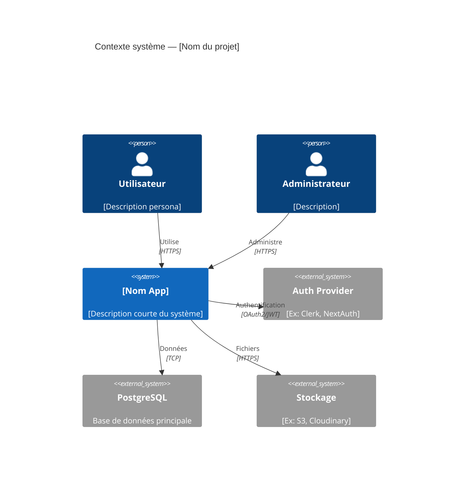
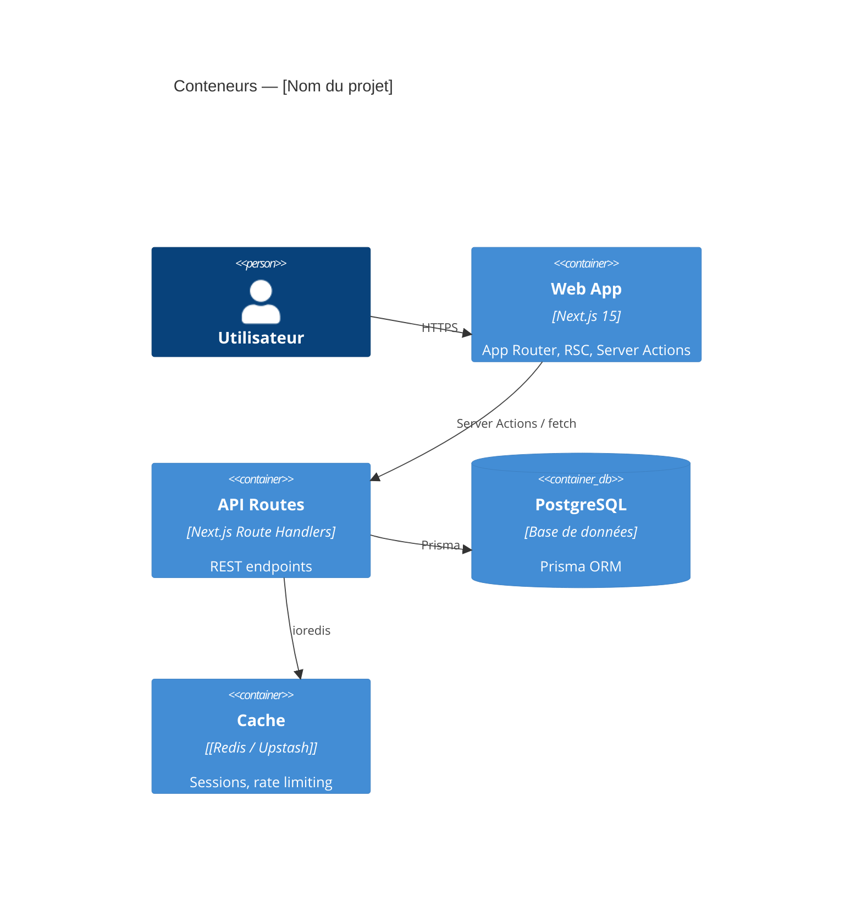
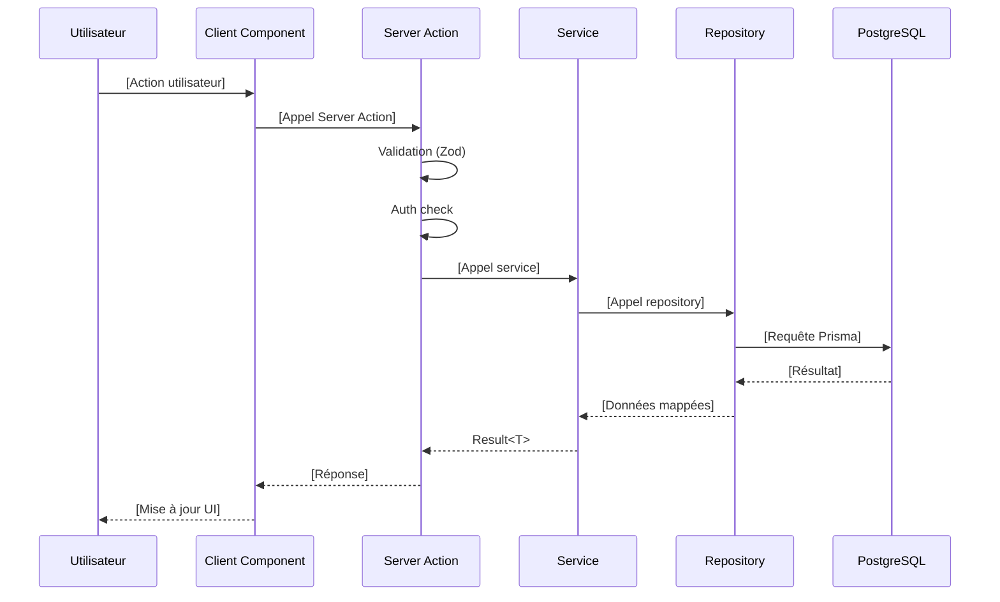

# Architecture Technique — [NOM DU PROJET]

> **Phase BMAD** : 3 — Solutioning
> **Agent** : architect (Winston)
> **Source** : docs/prd.md, docs/front-end-spec.md
> **Statut** : Draft | Approuvé

---

## Diagramme C4 — Contexte



---

## Diagramme C4 — Conteneurs



---

## Stack technique

| Couche | Technologie | Version | Justification |
|--------|-------------|---------|---------------|
| Frontend | Next.js App Router | 15.x | SSR, RSC, performance |
| Language | TypeScript | 5.x (strict) | Sécurité des types |
| Base de données | PostgreSQL + Prisma | PG 16 / Prisma 5 | Relationnel, ORM typé |
| Auth | [NextAuth / Clerk] | [version] | [Justification] |
| Tests | Vitest + Testing Library | Latest | Rapide, DX excellent |
| Style | Tailwind CSS | 3.x | Utility-first, cohérence |
| Cache | [Redis / Upstash] | Latest | [Si applicable] |
| CI/CD | GitHub Actions | — | Intégration native |
| Hosting | [Vercel / Railway] | — | Déploiement simplifié |

---

## Architecture en couches

```
┌─────────────────────────────────────────────────────┐
│               Client (Browser)                       │
│   React Client Components │ State Management         │
├─────────────────────────────────────────────────────┤
│               Next.js App Router                     │
│   Server Components │ Server Actions │ API Routes    │
├─────────────────────────────────────────────────────┤
│               Service Layer                          │
│         Business Logic │ Validation (Zod)            │
├─────────────────────────────────────────────────────┤
│               Repository Layer                       │
│              Prisma ORM │ Queries                    │
├─────────────────────────────────────────────────────┤
│               PostgreSQL                             │
└─────────────────────────────────────────────────────┘
```

---

## Structure des dossiers

```
src/
├── app/                    # Routes Next.js (App Router)
│   ├── (auth)/             # Groupe de routes auth
│   ├── api/                # Route handlers
│   │   └── [ressource]/
│   │       └── route.ts
│   └── [feature]/
│       ├── page.tsx
│       └── layout.tsx
├── components/             # Composants React
│   ├── ui/                 # Composants atomiques (Button, Input...)
│   └── features/           # Composants de feature
│       └── [feature]/
├── lib/                    # Utilitaires et clients
│   ├── prisma.ts           # Client Prisma (singleton)
│   ├── auth.ts             # Config auth
│   └── utils.ts            # Helpers
├── server/                 # Logique serveur uniquement
│   ├── actions/            # Server Actions Next.js
│   ├── services/           # Logique métier
│   └── repositories/       # Accès aux données
└── types/                  # Types TypeScript partagés
```

---

## Flux de données principaux

### Flux 1 : [Nom du flux principal]



---

## Patterns architecturaux

### Gestion des erreurs — Result Type

```typescript
type Result<T, E = AppError> =
  | { ok: true; value: T }
  | { ok: false; error: E }

const ok = <T>(value: T): Result<T, never> => ({ ok: true, value })
const err = <E>(error: E): Result<never, E> => ({ ok: false, error })
```

### Repository Pattern

```typescript
// Interface dans src/server/repositories/[ressource].repository.ts
interface [Ressource]Repository {
  findById(id: string): Promise<[Ressource] | null>
  findMany(filters: [Ressource]Filters): Promise<[Ressource][]>
  create(data: Create[Ressource]Input): Promise<[Ressource]>
  update(id: string, data: Update[Ressource]Input): Promise<[Ressource]>
  delete(id: string): Promise<void>
}
```

### Authentification & Autorisation

```typescript
// Vérification dans Server Action / Route Handler
const session = await auth()
if (!session?.user) {
  return err(new UnauthorizedError())
}

// Vérification RBAC
if (!hasPermission(session.user, 'resource:action')) {
  return err(new ForbiddenError())
}
```

---

## Schéma de données (Prisma)

```prisma
// prisma/schema.prisma

model [Entité] {
  id        String   @id @default(cuid())
  createdAt DateTime @default(now())
  updatedAt DateTime @updatedAt

  // Champs métier
  [champ]   [Type]

  // Relations
  [relation] [Relation][]

  @@index([[champ]])
  @@map("[table_name]")
}
```

---

## Observabilité

### Logs structurés

```typescript
import { logger } from '@/lib/logger'
// Format JSON avec context: service, userId, requestId
logger.info({ event: 'user.created', userId }, 'User created')
```

### Métriques clés

- Taux d'erreur par route/action
- P95 latence des appels BDD
- Taux de succès des Server Actions

---

## Sécurité

- [ ] Headers de sécurité (CSP, HSTS) dans `next.config.ts`
- [ ] Validation des inputs avec Zod sur toutes les Server Actions
- [ ] Rate limiting sur les routes publiques
- [ ] Pas de secrets dans le code (utiliser `.env`)
- [ ] CORS configuré explicitement

---

## ADRs associés

| ADR | Décision | Statut |
|-----|----------|--------|
| [001-tech-stack.md] | Stack Next.js + PostgreSQL | Accepté |
| [002-auth-strategy.md] | [Choix auth] | Accepté |
| [003-error-handling.md] | Result type | Accepté |

---

## Prochaines étapes (Phase 3 suite)

- [ ] Créer `docs/project-context.md` (constitution du projet)
- [ ] Créer les épics : `use scrum-master agent` → commande `CE`
- [ ] Valider l'Implementation Readiness : commande `IR`
